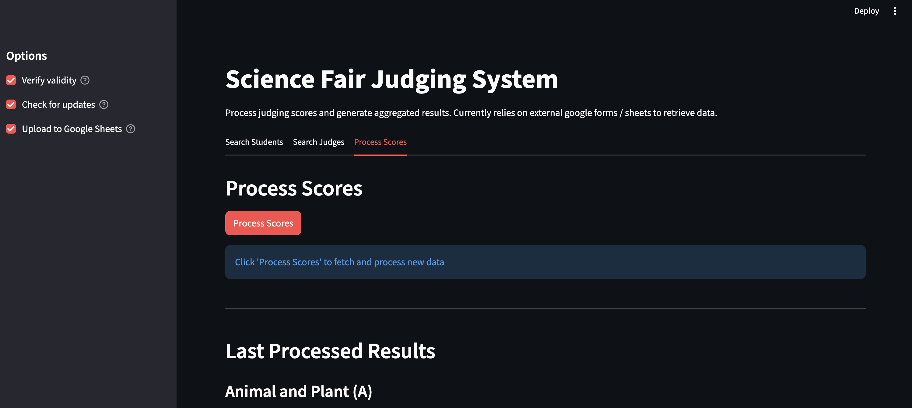

# Science Fair Judging System

This is built on software developed for the 2025 New Jersey Academy of Science (NJAS) Junior Symposium with a more generalized user interface for easier monitoring. The main ideas are to track judging scores for student projects, generate summary statistics, and verify input validity. At some point it may be a good idea to create a unified interface to handle judge signup, project registration, and score processing but for now the program requires some manual setup. Feel free to [email me](mailto:25benjaminli@gmail.com) with any questions about usage. 

## Installation

1. Install [uv](https://github.com/astral-sh/uv) if you haven't already.

2. Install project dependencies:
```sh
uv sync
```

3. Set up Google Sheets API:
   - Create a service account and download the credentials JSON file
   - Share your Google Spreadsheet with the service account email
   - Create a `.env` file in the project root:
   ```
   SPREADSHEET_KEY=your_google_spreadsheet_key
   ```

## Data Format

All input files should be placed in the `2025` directory. Fair organizers should stick to the following formats for the program to work correctly. The program performs various checks to ensure data integrity but the **data must be in the correct format.** I recommend doing some dry runs with dummy data to verify the program is working and understand how to operate it.

### `ids_categories.csv`

Maps student projects to categories and assigned judges.

| Category | ID (project) | Student First Name | Student Last Name | Judge 1 | Judge 2 | Judge 3 | ... |
|--------------|----------|-------------------|------------------|---------|---------|---------|-------|
| Animal and Plant Science | APS01 | John | Doe | Alice Smith | Bob Jones | Carol White | ...
| Math and Computer Science | MCS01 | Jane | Smith | Zachery Smith | Neville Ford | Pam Rogers | ...
|  | MCS02 | Jacob | Green | Zachery Smith | Neville Ford | Pam Rogers | ...
| Chemistry/Biochemistry | CHE01 | Mike | Johnson | David Lee | Emily Brown | Frank Davis | ...

**Key Points:**
- The `Category` column can forward-fill: blank cells inherit the category from above (e.g. MCS02 is also in Math and Computer Science)
- Judge columns (1-6) can be left blank if fewer judges are assigned or modified to fit the fair's needs
- Project IDs must be unique and match IDs in scoring data
- Judge names should match format in `ids_judges.csv` (format: "First Last") to match them to their IDs. 

### `ids_judges.csv`

List of all judges with unique identifiers. These IDs must be consistent throughout the process. 

| JUDGE ID | FIRST | LAST |
|----------|-------|------|
| ASM | Alice | Smith |
| BJO | Bob | Jones |   
| CWH | Carol | White |
| DLE | David | Lee |
| EBR | Emily | Brown |

### `raw_scores.csv`

This is acquired via the spreadsheet connected to the google form. I set up a simple google form with the "multiple choice grid" option titled "presentation content" (although this could be named whatever you want, just adjust the filtering code). The resulting spreadsheet should look like this. 

| Timestamp | Email Address | Judge ID | Student Project ID | Presentation Content [Background] | Presentation Content [Originality] | Presentation Content [Methodology] | ... | Other Comments | Student Name |
|-----------|---------------|----------|-------------------|----------------------------------|---------------------------------------------------------------|-----------------------------------------------------------------------------|-----|----------------|--------------|
| 2025-01-15 10:30:00 | alice@example.com | ASM | APS01 | 8 | 9 | 7 | ... | Great project | John Doe |
| 2025-01-15 10:35:00 | bob@example.com | BJO | APS01 | 7 | 8 | 8 | ... | Well done | John Doe |
| 2025-01-15 10:40:00 | carol@example.com | CWH | CHE01 | 9 | 9 | 8 | ... | Excellent work | Mike Johnson |

**Key Points:**
- The "..." represents additional scoring columns from the judging rubric
- `Timestamp` and `Email Address` are ignored
- `Student Project ID` are enforced to match IDs in `ids_categories.csv`
- `Judge ID` are enforced to match IDs in `ids_judges.csv` and will throw warnings otherwise

### `output.csv`

The output of the program averages the scores for each project, sorts them by category and performance, and includes other details like assigned judges, judges had, etc. It's meant to track overall judging progress and can be collected at any point during the process. The following is the structure:

| Category | Student Project ID | Student Name | Title of Presentation | Average Total Score | Judges Num | Judges Had | Assigned Judges |
|----------|-------------------|--------------|-----------------------|---------------------|------------|------------|----------------|
| Animal and Plant (A) | APS01 | Jane Doe | The Effects of Microplastics on Aquatic Life | 85.5 | 3 | ASM, BJO, CWH | ASM, BJO, CWH |
| Animal and Plant (A) | APS02 | John Smith | The Impact of Urbanization on Local Flora | 78.0 | 2 | BJO, CWH | ASM, BJO, CWH |
| Math and Computer Science (MCS) | MCS01 | Alice Johnson | Machine Learning for Predicting Stock Prices | 92.0 | 3 | DLE, EBR, FDR | DLE, EBR, FDR |
| ... | ... | ... | ... | ... | ... | ... | ... |


## Running the Program

### Streamlit Web Interface

```sh
uv run streamlit run st.py
```

The web interface as shown below features three tabs:
1. Searching for a student: enter ID or name and it will pull up information about the student (e.g. project title, assigned/received judges, etc). 
2. Searching for a judge: enter ID or name, it will provide info on what projects someone has judged so far. 
3. Processing and viewing scores: clicking the button scrapes the data from the google sheet connected to the form, processes everything, and optionally sends it back to a new tab in the remote sheet. The updated data is visible and available locally as well. There are options to "verify validity" (e.g. check for sufficient judges, project ID exists, duplicate entries, judge in allowed list) and check for updates. 



## License
MIT